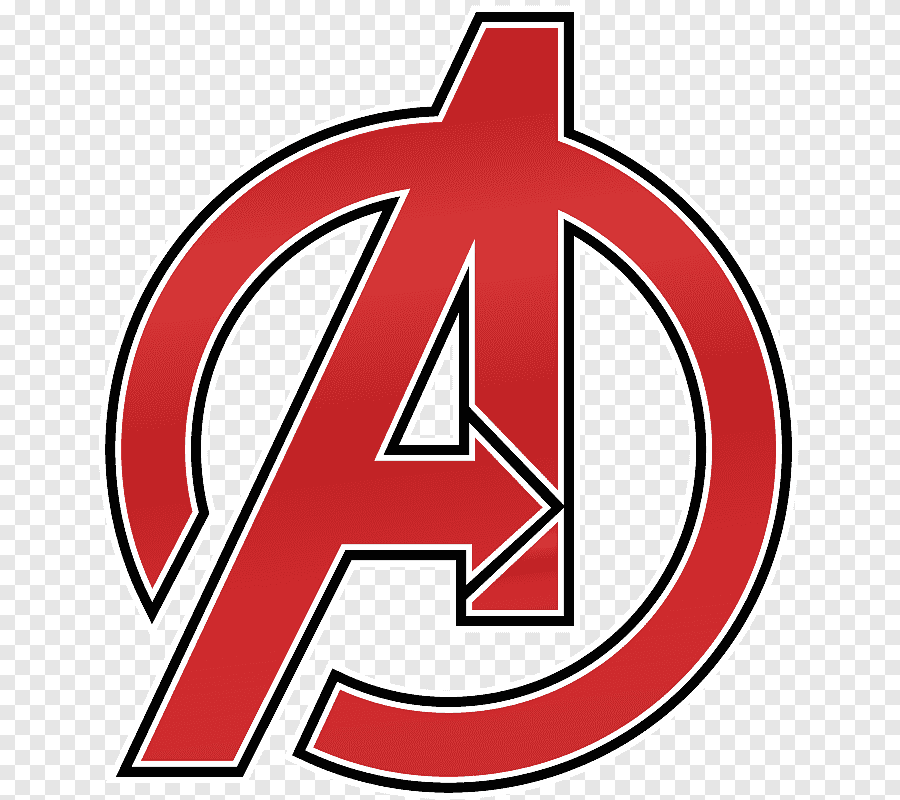
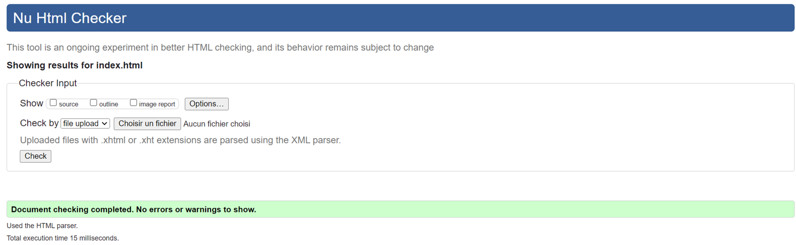
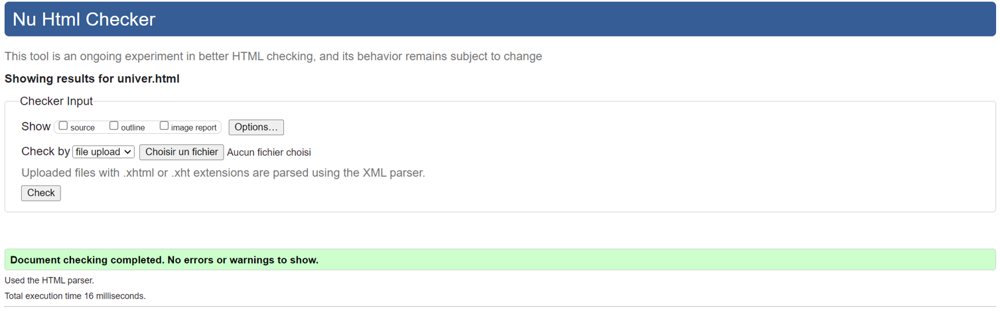
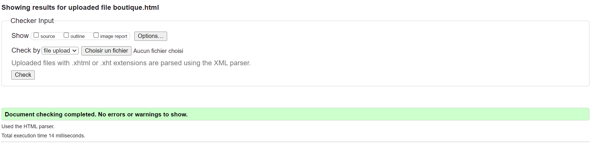
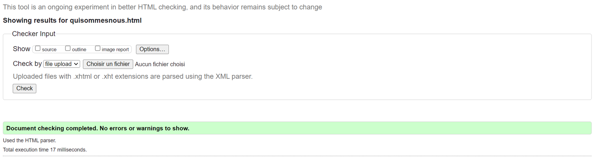
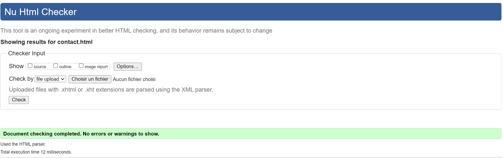
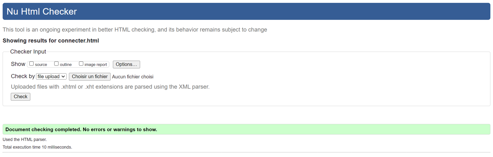

#Aknowhere

.

* Ela BULUT TP3
ela.bulut1@etu.univ-lorraine.fr
.

* Léo-Pol ARNOULD TP3 
leo-pol.arnould5@etu.univ-lorraine.fr
.

**Le choix du nom du groupe à été décidée avec l'univers de Marvel, Knowhere representant une planète dans Marvel, nous avons décider de rajouter le A qui represente les Avengers.L'objectif du site internet est de vendre des objects unique et mettre des informations sur l'univers Marvel**

Notre motivation pour le sujet, nous sommes des fans de marvel c'est pour ça que nous avons decider de faire sur ce sujet.


# Table des matières

- [Table des matières](#table-des-matières)
- [Liens Webetu {#Liens-Webetu}](#liens-webetu-liens-webetu)
- [Description des pages {#description}](#description-des-pages-description)
  - [Page d'Accueil {#page-accueil}](#page-daccueil-page-accueil)
  - [Boutique {#boutique}](#boutique-boutique)
  - [Qui sommes-nous {#qui-sommes-nous}](#qui-sommes-nous-qui-sommes-nous)
  - [Se connecter {#connecter}](#se-connecter-connecter)
  - [Page Univers {#univer}](#page-univers-univer)
  - [Page Contact {#contact}](#page-contact-contact)
  - [Page Erreur 404 {#404}](#page-erreur-404-404)
  - [Page Erreur 403 {#403}](#page-erreur-403-403)
- [Fichier JS {#js}](#fichier-js-js)
  - [Boutique {#boutiquejs}](#boutique-boutiquejs)
- [Arborescence {#Arborescence}](#arborescence-arborescence)
- [flavicon {#flavicon}](#flavicon-flavicon)
- [Police {#police}](#police-police)
- [W3C {#w3c}](#w3c-w3c)
    - [Index](#index)
    - [Univer](#univer)
    - [Boutique](#boutique)
    - [Qui sommes-nous](#qui-sommes-nous)
    - [Contact](#contact)
    - [Se connecter](#se-connecter)
- [Contraintes {#contraintes}](#contraintes-contraintes)
- [Auto évalutation {#autoevaluation}](#auto-évalutation-autoevaluation)
    - [Auto évaluation (Ela)](#auto-évaluation-ela)
    - [Autoévaluation (Léo-Pol)](#autoévaluation-léo-pol)
- [Crédit {#Credit}](#crédit-credit)

# Liens Webetu {#Liens-Webetu}

Ela BULUT
https://webetu.iutnc.univ-lorraine.fr/~e8218u/SAE105_Aknowhere/
https://webetu.iutnc.univ-lorraine.fr/~arnoul216u/


# Description des pages {#description}

## Page d'Accueil {#page-accueil}


- La page d'accueil utlise uniquement du codage HTML et CSS, est structurée par un header et un footer contenant logo et lien vers les autres pages (il en va de même pour le footer)

- On retrouve une citation en dessous de la bannière avec une police récupéré sur Google font 

- L'image qui sert de fond a la page accueil est la même que la bannière de mon read me 

- On retrouve 2 images (qui sont dans une balise div avec chacun une class différente) ces deux images sont faites pour être cliquable et emmnenné vers les pages Univers et Boutique

- On retrouve une autre et dernière image étant un hommage à Stan Lee (Défunt créateur de Marvel) avec un texte d'hommage en dessous (écrit dans un police venant de Google font)

- W3C Valide


- Page faites par Léo-Pol
## Boutique {#boutique}

La page boutique est la page où tout les objets peut etre consulter.

Le fonctionnement de la page est très simple. Elle est structurer d'un header.
Pour faire un carousel l'utilisation d'un **from en javascript** été plus adapter.
Pour les blocs de presentation que nous avons a pris a comme structure: 
``` <div class="o">
    
    <h2>Gant de Thanos</h2>
    <p>300€</p>
    <ul>
        <li>Résistant Pierres</li>
        <li>Pierres non-fournis</li>
</ul>
</div>
```
Nous avons d'abord l'image qui est afficher puis apres le nom de l'objet. Ensuite nous avons le details avec le prix et les caracteristiques de l'object.

Cette page a été ecrit avec les languages HTML/CSS et Javascript.
Toute la page à été faite par Ela 


## Qui sommes-nous {#qui-sommes-nous}

La page Qui sommes-nous est la page où les informations sur l'equipe, les motivations et le but du site internet peut etre consulter.

Le fonctionnement de la page est très simple. Elle est structurer d'un header.

Pour les blocs de presentation que nous avons a pris a comme structure: 
``` <div class="titre">
        <h1>Qui sommes-nous?</h1>
    </div> 
    <div class="paragraphe">
    <section class="s"> 

        <h2> Notre équipe</h2>
        <p>Derrière chaque produit exceptionnel chez A Knowhere se trouve une équipe tout aussi extraordinaire. Nous sommes fiers de réunir des esprits créatifs, des passionnés de Marvel et des experts dévoués, tous unis par un amour inconditionnel pour l'univers des super-héros.Faites connaissance avec notre équipe, des passionnés qui partagent votre enthousiasme et qui sont ravis de faire partie de votre aventure Marvel chez A Knowhere.</p>
        
        
        
    </section>

```
Nous avons d'abord le titre de la section qui est afficher puis le paragraphe. Ensuite pour le premier paragraphe nous avons des images.

Cette page a été ecrit avec les languages HTML/CSS et Javascript.
Toute la page à été faite par Ela 

## Se connecter {#connecter}

Sur cette page nous avons une pages de connection avec les differents élements comme : identifiants , mots de passe.

```
<div class="wrapper">
        <form action="#">
            <h1>Connexion</h1>
            <div class="input-box">
                <input type="email" placeholder="Identifiant" required>
                <i class='bx bxs-user'></i>
            </div>

            <div class="input-box">
            <input type="password" placeholder="Mots de passe">
            <i class='bx bxs-lock-alt'></i>
            </div>
            
            <div class="rappel-oublie">
                <label><input type="checkbox">Se rappeller de moi!</label>
                <a href="#">Mots de passe oublier</a>
    
            </div>
            <button type="submit" class="btn"> Se connecter</button>
            <div class="lien-enregistrement">
                <p>Je n'ai pas de compte</p>
                <a href="#">S'incrire</a>
            </div>
            <button onclick="window.location.href='../index.html'" class="btn" > Retour à l'Accueil</button>
        </form>
```
Div wrapper (```<div class="wrapper">```): Cette balise div englobe l'ensemble du contenu de la page de connexion, utilisée pour appliquer des styles ou structurer la mise en page.

Formulaire (```<form action="#">```): Un formulaire HTML utilisé pour collecter des informations d'identification. L'attribut action="#" indique que le formulaire n'a pas encore d'action définie.

Titre de la page (```<h1>Connexion</h1>```): Un titre "Connexion" qui est généralement affiché en haut du formulaire.

Champs de saisie (```<div class="input-box">```): Deux champs de saisie sont inclus, un pour l'adresse e-mail (type email) avec une icône d'utilisateur, et un pour le mot de passe (type password) avec une icône de cadenas.

Case à cocher et lien "Mots de passe oublier" (```<div class="rappel-oublie">```): Une section comprenant une case à cocher pour se rappeler de l'utilisateur et un lien pour réinitialiser le mot de passe.

Bouton de connexion (<```button type="submit" class="btn> Se connecter</button>```): Un bouton de soumission du formulaire avec l'étiquette "Se connecter" et la classe "btn" pour appliquer des styles.

Section d'enregistrement (```<div class="lien-enregistrement">```): Une section qui indique "Je n'ai pas de compte" avec un lien pour s'inscrire.

Bouton de retour à l'accueil (```<button onclick="window.location.href='../index.html'" class="btn" > Retour à l'Accueil</button>:```) Un bouton qui redirige l'utilisateur vers la page d'accueil lorsque cliqué.
Cette page a été fait en HTML/CSS et JS

Toute la page à été faite par Ela

## Page Univers {#univer}

- La page d'univers utlise du codage HTML, CSS, JS et JSON et est structurée par un header et un footer contenant logo et lien vers les autres pages (il en va de même pour le footer)

- La page contient plusieurs image expliquant les personnages et lieux de l'univers (le site ne contient pas tout les personnages car il nous est impossible de mettre 7000 personnages et environ 50000 si on compte les lieux) la totalité de ces dernier sont contenus dans une div 

- A noter que la page contient un filtre pour filtrer les Villains, Héros ou Lieu avec un bouton reset le tout fait dans un Codage en utilisant la fonction FilterCategory

- L'image de fond est la même que celle de l'Accueil 

- Le CSS contient des display flex mais aussi des éléments permettant de mettre toutes mes images côte à côte

- Pour avoir des images de même taille je suis passé par le logiciel Photoshop afin de régler la taille des images sans pour autant les déformer 

- Le CSS m'a servi pour également modifier la couleurs des textes mais aussi l'esthétique des boutons qui sont maintenant plus agréable à l'oeil 

- Fragment JSON :

 {
       "image":"Thanoslegentil.jpg",
       "nom":"Thanos",
       "Lieu" : "planète Titan",
       "Caractéristique":"Force et résistance",
       "Type":"Villain",
       "Complet":"Thanos",
       "surnom":"Titan Fou",
       "taille": ["2.01m pour 447kg"]
     },
   
     {
       "image":"Knowhere.webp",
       "nom":"Knowhere",
       "Lieu" : "Knowhere, colonie minière",
       "Type" : "",
       "Complet":"",
       "surnom":"",
       "Caractéristique": "Tête de titan Celeste",
       "taille": ["Très grande taille"]   
     },

- La structuration de mon JSON est organisé de manière à ce que chaque ait sous elle un texte avec des caractérisque différentes pour quasiment toutes les images


- Page faites par Léo-Pol


## Page Contact {#contact}

- La page contact utilise du codage HTML et CSS et est structurée par un header et un footer contenant logo et lien vers les autres pages (il en va de même pour le footer)

- La page de contact propose un formulaire de contact sous forme de tableau (Tableau fortement inspiré d'un exercice vu en cours d'intégration web), contenant des balises td et tr ainsi qu'un menu déroulant avec option value 

- Le tableau à été modifié en CSS, la couleur des cases est changé ainsi que le fond du tableau 

- L'image en fond du site provient d'une couverture de comics que j'ai aggrandi et développé avec photoshop (avec l'aide de L'IA générative de photoshop)

- Page faites par Léo-Pol

## Page Erreur 404 {#404}

- La page Erreur 404 utilise du codage HTML et CSS et est structurée par un header et un footer contenant logo et lien vers les autres pages (il en va de même pour le footer)

- La page Erreur 404 est très simple elle utilise seulement des balises p br et h1 h2 et a

- Dans le CSS j'ai organisé mes éléments de manières a ce que texte images et bouton soit au centre de la page 

- On trouve également un bouton personnalisé (avec dégradé) ramenant à l'accueil 

- Page faites par Léo-Pol

## Page Erreur 403 {#403}

Cette page HTML est une page d'erreur 403 (Accès interdit) avec un message personnalisé.

 ```   <div class="container">
        <h1>4
             3</h1><p>Tu n'as pas le droit d'être ici</p><br>
            <p>Une équipe du Shield est en route!</p>
            <button onclick="window.location.href='../index.html'" class="btn" > Retour à l'Accueil</button>
      </div>
```

Div container (```<div class="container">```): Cette balise div englobe l'ensemble du contenu de la page d'erreur 403.

Titre et image (```<h1>4  3</h1>```): Un titre qui semble représenter le code d'erreur "403" avec une image située entre les chiffres. Cela crée une sorte de composition visuelle.

Message d'erreur ```(<p>Tu n'as pas le droit d'être ici</p>)```: Un paragraphe qui affiche le message personnalisé "Tu n'as pas le droit d'être ici", indiquant un accès interdit.

Autre message (```<p>Une équipe du Shield est en route!</p>```): Un autre paragraphe indiquant que "Une équipe du Shield est en route", ajoutant une touche humoristique ou thématique à l'erreur.

Bouton de retour à l'accueil (```<button onclick="window.location.href='../index.html'" class="btn" > Retour à l'Accueil</button>```): Un bouton qui redirige l'utilisateur vers la page d'accueil lorsque cliqué.


- Page faites par Ela 

# Fichier JS {#js}

## Boutique {#boutiquejs}

Pour dynamiser le site internet nous avons utiliser du JavaScript Object Notation (JSON) est le format d'échange de données qui répond à ce besoin.
Pour cela nous utilisons un tableau avec des chaines de carartères.

```
const boutique = `[
 {
    "image":"gant.png",
    "video":"gant.mp4",
    "nom":"Gants de thanos",
    "prix" : 300,
    "taille": "40cm",
    "option": ["Résistant "," Pierres non-fournis"]
  },
  {
    "image":"bouclier.png",
    "video":"bouclier.mp4",
    "nom":"Bouclier de Captaine América",
    "prix" : 190,
    "taille": "61cm",
    "option": ["Vibranium "," Dédicasse de Captaine América"]
  }`,
```

**Pour le controleur JS**, nous avons la structure suivante: 
```
const madiv = document.querySelector(".container");
var datas = JSON.parse(boutique)
var affichage = '';
for (i=0;i<datas.length; i++){
    affichage += `
            <div class="o">
            
            <h2>${datas[i].nom}</h2>
            <p>${datas[i].prix} €</p>
            <p>${datas[i].option}</p>
            <button onclick="window.location.href = '#ouvreModale${i}';">Aperçu </button>
            <div id="ouvreModale${i}" class="modalDialog">
      <div>
        <a href="#close" title="Fermer" class="close">x</a>
        <video src="../medias/boutique/gif/${datas[i].video}" alt="video${datas[i].titre}" autoplay loop muted>
      </div>
    </div>
    </div>
`
}
madiv.innerHTML = affichage;
```

La méthode **querySelector()** de l'interface Document retourne le premier Element dans le document correspondant au sélecteur , ici .container qui se trouve dans le HTML boutique.

La fonction **JSON.parse()** est utilisée pour convertir une chaîne JSON en un objet JavaScript, ce qui facilite la manipulation des données dans le code.
La boucle for parcourt chaque élément dans le tableau datas.

À chaque itération de la boucle, le code HTML est construit en utilisant la syntaxe des littéraux de gabarits (template literals) avec la syntaxe **${...}** pour incorporer les valeurs des propriétés de l'objet **datas[i]** dans la chaîne.

Le code généré contient une structure HTML pour afficher les détails de chaque élément, y compris une image, un titre, un prix, une option, et un bouton "Aperçu".

Un élément de type modal (fenêtre contextuelle) est inclus pour chaque élément avec un bouton "Aperçu". Le modal est déclenché par le clic sur le bouton et contient une vidéo associée à l'élément actuel.

La variable **affichage** est mise à jour à chaque itération en ajoutant le code HTML généré.

# Arborescence {#Arborescence}


sae105-nomProjet (dossier racine du site)

+-- statique
  |  +-- index.html
  +-- css (dossier)
  |  | +-- 403.css
  |  | +-- 404.css
  |  | +-- boutique.css
  |  | +-- connecter.css
  |  | +-- contact.css
  |  | +-- index.css
  |  | +-- quisommesnous.css
  |  | +-- univers.css
  |+-- pages (dossier)
  |  | +-- boutique.html
  |  | +-- connecter.html
  |  | +-- contact.html
  |  | +-- quisommesnous.html
  |  | +-- univer.html 
  |+-- medias
  |  | +-- backgroundmarvel.jpg 
  |  | +-- 403.png
  |  | +-- picto.svg
  |  | +-- bannière.
  |  | +-- blackcat.png
  |  | +-- Bricoleur.webp
  |  | +-- Couverture_deadpool.png
  |  | +-- fond403.png
  |  | +-- galaxie.png
  |  | +-- chien.png
  |  | +-- egopascontent.png
  |  | +-- falvicon.png
  |  | +-- ganttrescoquet.png
  |  | +-- image_accueil.png
  |  | +-- Leopol.png
  |  | +-- logo.png
  |  | +-- papy_stan.png
  |  | +-- TheAvengers-BackgroundVideo.mp4
  |  | +-- FantasticFourIntroMCU.mp4
  |  | +-- boutique 
  |  | | +-- arme.png
  |  | | +-- armure.png
  |  | | +-- bouclier.png
  |  | | +-- bracelet.png
  |  | | +-- collier.png
  |  | | +-- darkhold.png
  |  | | +-- gant.png
  |  | | +-- heart.png
  |  | | +-- lunette.png
  |  | | +-- thor
  |  | | +-- gif 
  |  | | | +-- arme.gif
  |  | | | +-- bouclier.gif 
  |  | | | +-- bracelet.gif 
  |  | | | +-- casque.gif 
  |  | | | +-- collier.gif 
  |  | | | +-- darkhold.gif 
  |  | | | +-- gant.gif 
  |  | | | +-- heart.gif 
  |  | | | +-- lunette.gif 
  |  | | | +-- thor.gif   
  |  | +-- pierre 
  |  | | +--bleu.png
  |  | | +--jaune.png
  |  | | +--orange.png
  |  | | +--rouge.png
  |  | | +--vert.png
  |  | | +--violet.png
  |  | +-- univer
  |  | | +--Asgard.png
  |  | | +--hommedefer.png
  |  | | +--Klyntar.png
  |  | | +--Knowhere.png
  |  | | +--Miles.png
  |  | | +--peter_parker.png
  |  | | +--PeterQuill.png
  |  | | +--terre616.png
  |  | | +--Thanoslegentil.png
  |  | | +--touravengers.png 
+-- readme (dossier)
  | +-- medias 
  | +-- README.md
  | +-- export 
+-- dynamique  
  | +-- .htaccess
  | +-- page403.html
  | +-- page404.html
  | +-- index.html 
  | +-- json (dossier)
  |  | +-- boutique.json 
  |  | +-- controleur.json
  |  | +-- controleurb.json
  |  | +-- univer.json
  |+-- css (dossier)
  |  | +-- 403.css
  |  | +-- 404.css
  |  | +-- boutique.css
  |  | +-- connecter.css
  |  | +-- contact.css
  |  | +-- index.css
  |  | +-- quisommesnous.css
  |  | +-- univers.css
  |+-- pages (dossier)
  |  | +-- boutique.html
  |  | +-- connecter.html
  |  | +-- contact.html
  |  | +-- quisommesnous.html
  |  | +-- univer.html 
  |+-- medias
  |  | +-- backgroundmarvel.jpg 
  |  | +-- 403.png
  |  | +-- picto.svg
  |  | +-- bannière.
  |  | +-- blackcat.png
  |  | +-- Bricoleur.webp
  |  | +-- Couverture_deadpool.png
  |  | +-- fond403.png
  |  | +-- galaxie.png
  |  | +-- chien.png
  |  | +-- egopascontent.png
  |  | +-- falvicon.png
  |  | +-- ganttrescoquet.png
  |  | +-- image_accueil.png
  |  | +-- Leopol.png
  |  | +-- logo.png
  |  | +-- papy_stan.png
  |  | +-- TheAvengers-BackgroundVideo.mp4
  |  | +-- FantasticFourIntroMCU.mp4
  |  | +-- boutique 
  |  | | +-- arme.png
  |  | | +-- armure.png
  |  | | +-- bouclier.png
  |  | | +-- bracelet.png
  |  | | +-- collier.png
  |  | | +-- darkhold.png
  |  | | +-- gant.png
  |  | | +-- heart.png
  |  | | +-- lunette.png
  |  | | +-- thor
  |  | | +-- gif 
  |  | | | +-- arme.gif
  |  | | | +-- bouclier.gif 
  |  | | | +-- bracelet.gif 
  |  | | | +-- casque.gif 
  |  | | | +-- collier.gif 
  |  | | | +-- darkhold.gif 
  |  | | | +-- gant.gif 
  |  | | | +-- heart.gif 
  |  | | | +-- lunette.gif 
  |  | | | +-- thor.gif   
  |  | +-- pierre 
  |  | | +--bleu.png
  |  | | +--jaune.png
  |  | | +--orange.png
  |  | | +--rouge.png
  |  | | +--vert.png
  |  | | +--violet.png
  |  | +-- univer
  |  | | +--Asgard.png
  |  | | +--hommedefer.png
  |  | | +--Klyntar.png
  |  | | +--Knowhere.png
  |  | | +--Miles.png
  |  | | +--peter_parker.png
  |  | | +--PeterQuill.png
  |  | | +--terre616.png
  |  | | +--Thanoslegentil.png
  |  | | +--touravengers.png


# flavicon {#flavicon}



# Police {#police}
La police utiliser est **Josefn Sans**, **Jura**, **Kalam** et **Numito Sans**
# W3C {#w3c}
### Index

### Univer

### Boutique

### Qui sommes-nous

### Contact

### Se connecter



# Contraintes {#contraintes}

**Générales**
Tous les éléments sont faits

**Intégration**
Non-fait:
- Le site devra être de largeur fixe


**Dévelloppement WEB**
Tous les éléments sont faits

**Hebergement**
Tous les éléments sont faits

# Auto évalutation {#autoevaluation}

Le header et le footer a été fait par Ela.
La page accueil, univer et contact a été faite par Léo-Pol.
La page Boutique, qui sommes-nous et Se connecter à été faite par Ela.
La structure de univer été faite par Ela.


### Auto évaluation (Ela)
- Intégration: 16/20
- Modélisation JSON: 14/20
- Développement JavaScript: 12/20
- Hébergement: 15/20
- Note globale individuelle: 17/20

### Autoévaluation (Léo-Pol)
- Intégration: 15/20
- Modélisation JSON: 12/20
- Développement JavaScript: 13/20
- Hébergement: 14.5/20
- Note globale individuelle: 14/20

Autoévaluation du groupe
Note globale du projet: 16/20

# Crédit {#Credit}

J'ai  trouvé des informations utiles sur les forums de **javascript**, **freefrontend** et **w3schools**.

Merci aussi a **Mathyss Michelin** du TP4 et des collègues dans le TD2 qui m'a aider sur certains points 